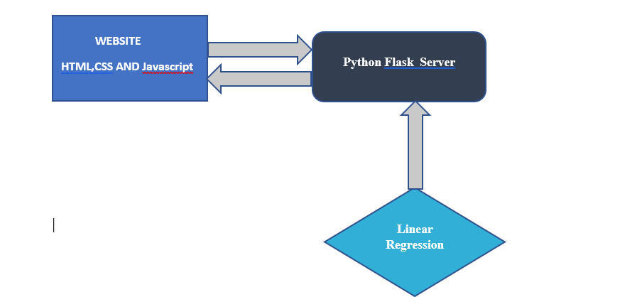
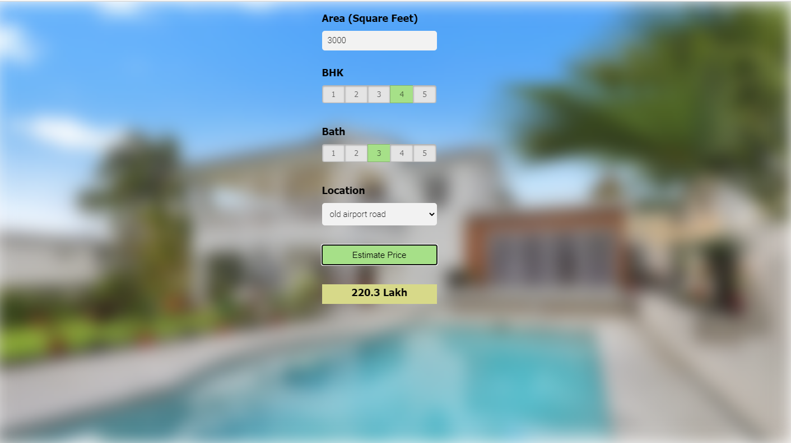

# PROJECT  1: Real Estate(Zameen.com) Price Prediction

## PROBLEM:
Assume that you are a data scientist working for a real estate company such as zameen.com. Your business manager comes to you and asks you to build a model that can predict the property price  based on certain features such as no. of bedrooms, bathrooms, location etc.

## PROJECT ARCHITECTURE:
We will first build a model using sklearn and linear regression using zameen.com dataset from kaggle.com(link: https://www.kaggle.com/huzzefakhan/zameencom-property-data-pakistan). Second step would be to write a python flask server that uses the saved model to serve HTTP requests. Third component is the website built in HTML, CSS and Javascript that allows user to enter area, bedrooms etc and it will call python flask server to retrieve the predicted price.

## DATA SCIENCE CONCEPTS:
We will implement data science concepts such as data load and cleaning, outlier detection and removal, feature engineering, dimensionality reduction, gridsearchcv for hyperparameter tunning, k fold cross validation etc. Technology and tools wise this project covers,
1.	Python
2.	Numpy and Pandas for data cleaning
3.	Matplotlib for data visualization
4.	Sklearn for model building
5.	Jupyter notebook, visual studio code and pycharm as IDE
6.	Python flask for http server
7.	HTML/CSS/Javascript for UI
## WEB APPLICATION

